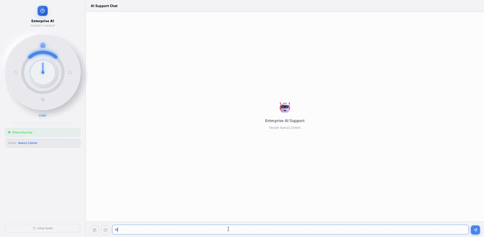

# Enterprise AI Support Chatbot

A full-stack AI-powered chatbot for enterprise support teams — built with **Ollama**, **LangChain**, **FastAPI**, and **React TypeScript**. Runs entirely **offline** on your local machine.



---

## ✨ Features

| Feature | Description |
|---------|-------------|
| 🤖 **Local AI** | Powered by [Ollama](https://ollama.com) — no API keys, full privacy |
| 🔄 **Streaming** | Real-time token-by-token response streaming via SSE |
| 📚 **RAG** | Upload PDF / TXT / MD documents and ground answers in your knowledge base |
| 🗂️ **Model Manager** | Browse, download and delete Ollama models with live progress bar |
| 🌓 **Dark / Light** | Smooth theme toggle with neumorphic design |
| 💬 **Chat History** | Persistent conversations stored in SQLite, with star/save support |
| 🎨 **Radial Nav** | Circular dial navigation with glowing arc indicator |
| ⚡ **Fast** | Vite + Tailwind v4 frontend, async FastAPI backend |

---

## 📸 Screenshots


---

## 🏗️ Tech Stack

### Backend
- **Python 3.10+** — FastAPI, Uvicorn
- **Ollama** — local LLM inference & embeddings
- **LangChain** + **ChromaDB** — RAG pipeline
- **SQLAlchemy** + **SQLite** — conversation persistence
- **httpx** — async HTTP & streaming

### Frontend
- **React 18** + **TypeScript**
- **Redux Toolkit** — state management
- **Tailwind CSS v4** — styling
- **Vite** — dev server & bundler
- **react-markdown** + **react-syntax-highlighter** — message rendering

---

## 🚀 Getting Started

### Prerequisites

| Requirement | Version |
|-------------|---------|
| Python | 3.10+ |
| Node.js | 18+ |
| [Ollama](https://ollama.com/download) | latest |

---

### 1. Start Ollama

```bash
ollama serve
```

Pull a language model (first time):

```bash
ollama pull llama3.2
```

For RAG/document search, also pull the embedding model:

```bash
ollama pull nomic-embed-text
```

---

### 2. Start the Backend

```bash
cd backend
python -m venv venv

# Windows
venv\Scripts\activate

# macOS / Linux
source venv/bin/activate

pip install -r requirements.txt
uvicorn app.main:app --reload --port 8001
```

API docs available at: `http://localhost:8001/docs`

---

### 3. Start the Frontend

```bash
cd frontend/chatbot-ui
npm install
npm run dev
```

Open `http://localhost:3003` in your browser.

---

## 📂 Project Structure

```
EnterpriseAIChatbot/
├── backend/
│   ├── app/
│   │   ├── routers/
│   │   │   ├── chat.py          # SSE streaming chat endpoint
│   │   │   ├── conversations.py # CRUD for chat history
│   │   │   ├── documents.py     # RAG document upload & management
│   │   │   └── models_router.py # Ollama model install / delete
│   │   ├── services/
│   │   │   ├── ollama_service.py  # Ollama API integration
│   │   │   └── rag_service.py     # ChromaDB vector store
│   │   ├── config.py
│   │   ├── database.py
│   │   └── main.py
│   └── requirements.txt
│
├── frontend/chatbot-ui/
│   ├── src/
│   │   ├── components/
│   │   │   ├── chat/        # ChatWindow with streaming
│   │   │   ├── history/     # Conversation history panel
│   │   │   ├── nav/         # RadialNav circular dial
│   │   │   ├── search/      # RAG knowledge base panel
│   │   │   ├── settings/    # Theme, model selector, model installer
│   │   │   └── guide/       # Setup & troubleshooting guide
│   │   ├── store/           # Redux Toolkit slices
│   │   ├── services/        # API calls
│   │   └── types/           # TypeScript types
│   └── package.json
│
└── screenshots/
```

---

## ⚙️ Configuration

Edit `backend/app/config.py` to customize:

```python
ollama_base_url  = "http://localhost:11434"   # Ollama server
default_model    = "llama3.2"                 # Default model
embedding_model  = "nomic-embed-text"         # Embedding model for RAG
max_history_msgs = 20                         # Context window size
system_prompt    = "You are a helpful enterprise support assistant..."
```

---

## 🔌 API Endpoints

| Method | Endpoint | Description |
|--------|----------|-------------|
| `POST` | `/api/chat/stream` | SSE streaming chat |
| `GET` | `/api/models` | List installed models |
| `GET` | `/api/models/available` | Browse installable models |
| `POST` | `/api/models/pull` | Download & install a model |
| `DELETE` | `/api/models/{name}` | Remove a model |
| `GET` | `/api/conversations` | List conversations |
| `POST` | `/api/documents/upload` | Upload document for RAG |
| `GET` | `/api/documents` | List indexed documents |

---

## 🛠️ Troubleshooting

**Ollama Offline** — Make sure `ollama serve` is running in a terminal.

**No models in list** — Pull at least one model: `ollama pull llama3.2`

**RAG not working** — Pull the embedding model: `ollama pull nomic-embed-text`

**CORS error** — Ensure your frontend port (`3003`) is in `config.py → cors_origins`.

**Backend not starting** — Check Python version (`python --version` must be 3.10+) and that the venv is activated.

---

## 📄 License

MIT © [Alibadloo](https://github.com/Alibadloo)
